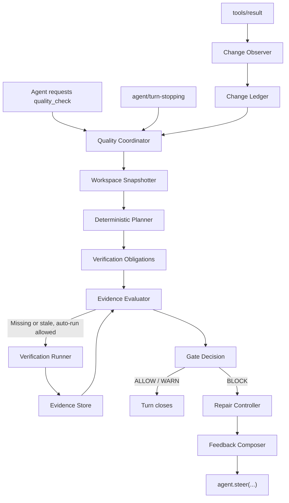

# DSH Quality v0.2：Evidence-driven Quality Gate

> 状态：核心已实现（2026-08-15）。当前仓库已实现 ChangeTracker、Git Workspace Snapshotter、确定性 Planner、Test Evidence Provider、内存 Evidence Store、变更集感知的并发 Gate、Repair Controller 与通用 HarnessHook；v0.1 CLI 仍保留为兼容入口。真实 DeepSeek Harness 注册、affected-test、Lint/Coverage/Security 和持久化仍未实现。

## 1. 结论与产品定义

DSH Quality 首先要回答的不是“要跑哪些检查”，而是一个更底层的问题：

> **什么条件满足以后，我们才允许 Agent 把任务视为完成？**

Agent 的“我完成了”是基于上下文的主观判断；工程上的完成状态必须由外部事实验证。代码能否构建、测试是否通过、验证是否仍对应当前代码，这些都不能由模型语言推理替代。

因此本项目的第一性原理是：

> **让 Coding Agent 在宣布任务完成之前，用与当前代码状态绑定的可验证证据，证明它满足项目定义的结束条件。**

可将整个系统抽象为：

```text
完成声明（Claim） → 所需证明 → 真实验证 → 证据判断 → 完成 / 修复
```

这里的“质量”不是抽象的代码评分；它是“当前 Policy 所要求的验证条件已经满足”。可信证明至少要相关、真实执行、新鲜且可追溯。验证失败或不足时，系统把偏差转成可操作反馈，让 Agent 修复后重新证明。

上一版“代码变更后立即跑检查”的方向适合作为独立 CLI，但不适合作为 Agent 的默认体验：一次任务往往包含多个中间态，逐次运行完整测试既慢又会制造无效失败。

v0.2 的核心定义是：

> **DSH Quality 让 Agent 在结束任务前，为当前变更提供足够、新鲜且可追溯的验证证据。**

简短表达：**Make agents prove their work.**

这不是把 CI 搬进 Agent，而是一个有状态的终止门禁。它只在两个地方主动工作：低成本地观察变更，以及在 Agent 即将自然结束时评估或补齐验证。

## 2. 已验证的 Harness 前提

- `tools/result` 提供不可变的最终工具结果；监听器失败会被隔离，适合作为观察入口，而不是执行重型检查的入口。[Tools subsystem](https://github.com/deepseek-ai/deepseek-harness/blob/master/docs/subsystems/tools.md)
- `agent/turn-stopping` 在没有工具调用或 steering 延续时发生；监听器可以 `agent.steer(...)`，使 Agent 继续下一步。[Core subsystem](https://github.com/deepseek-ai/deepseek-harness/blob/master/docs/subsystems/core.md)
- 无条件在 stop checkpoint 阻断会导致无限续跑，Harness 的 Codex bridge 也明确要求调用方自行设置停止条件。[Codex hook bridge](https://github.com/deepseek-ai/deepseek-harness/blob/master/packages/hooks/hooks-codex/src/index.ts)

这些能力足以实现 Gate；但它们不意味着可以在生命周期回调中无限制、无审计地执行任意命令。因此所有验证都必须由同一个有超时、可取消、可记录的 `VerificationRunner` 执行。

## 3. 目标与非目标

### v0.2 必须证明

1. Agent 改动代码后，终止门禁可以知道哪些验证义务尚未被满足。
2. 已通过的测试在相关代码再次变化后，不会被误当作有效证据。
3. 门禁失败会给出短、可操作、可定位的反馈，并在有限次数内要求 Agent 继续。
4. 检查失败、检查无法执行、证据过期三者在数据模型中可区分。

### v0.2 不做

- AI 风险分类、affected-test 分析、Coverage、Security、Dashboard、远程存储。
- 多 Agent 共用同一工作区的协同调度。
- 把任意 Agent Shell 文本当作质量命令执行。

第一版 Planner 必须是确定性规则表；无法可靠识别的改动采用保守计划，而不是假装“智能”。

## 4. 总体架构



核心边界：

| 模块 | 责任 | 不负责 |
| --- | --- | --- |
| Change Observer | 从工具终态记录线索 | 判断测试是否有效 |
| Workspace Snapshotter | 在 Gate 时产出真实 ChangeSet | 决定检查策略 |
| Planner | 由规则和 Policy 生成验证义务 | 执行命令 |
| Verification Runner | 运行受信任 Provider 并产出 Evidence | 决定是否放行 |
| Evaluator | 用 Evidence 满足/拒绝义务 | 格式化 Agent 文案 |
| Repair Controller | 限制续跑与无进展循环 | 重新解释测试日志 |

## 5. 生命周期

### 5.1 Observe：只记账，不跑测试

`tools/result` 只追加 `ToolObservation`：工具名、成功与否、声明的路径、时间、是否由 DSH Quality 发起。它是低成本线索，不是变更真相；Shell 工具可能修改任意文件而不返回路径。

当前实现会先由 `ChangeTracker` 根据宿主事件提供的 `changedFiles` 记录路径，并在文件可读时加入内容摘要；随后 `GitWorkspaceSnapshotter` 在 Gate 前合并 `HEAD` 以来的已跟踪改动与未跟踪文件，产出当前真实工作树的 `ChangeSet`。Git 不可用时退回 Observer 快照并强制 `confidence = low`；`mayHaveMutated` 但没有路径的工具也保留 low confidence，即使工具最后失败。DSH Quality 自己产生的报告文件必须排除，避免自触发。

```ts
interface ChangeSet {
  id: string;
  base: { revision?: string; capturedAt: Date };
  entries: Array<{
    path: string;
    kind: "source" | "test" | "build" | "docs" | "unknown";
    contentDigest: string;
  }>;
  confidence: "high" | "low";
  observedAt: Date;
}
```

### 5.2 Checkpoint：主动验证

目标是暴露一个一等 `quality_check` 入口，供 Agent 或用户主动调用。当前 `QualityCoordinator.gate()` 已可被宿主主动调用，且与最终 Gate 共享 Planner、Provider 和 Evidence Store；v0.1 CLI 仍是兼容的独立入口，尚未迁移为该主动检查工具。

### 5.3 Gate：先评估，再按需补证

当前通用 `HarnessHook` 在 `agent/turn-stopping` 执行以下流程：

1. 快照当前 ChangeSet，编译 Verification Obligations。
2. 评估缓存 Evidence 是否满足这些义务。
3. 仅当证据缺失或过期，且本 ChangeSet 尚未自动执行过该计划时，运行一次有界验证。
4. 再次评估；`ALLOW` / `WARN` 允许结束，`BLOCK` 通过 steering 反馈给 Agent。

这样首次结束会自动验证；测试失败后的 Agent 若没有修改相关输入，第二次 Gate 直接复用仍然新鲜的失败证据，而不是重复跑同一个失败命令。

## 6. Evidence：结果、可用性和决策必须分层

不要让 `PASS | FAIL | ERROR | SKIPPED | STALE` 变成同一个枚举。`STALE` 不是 Provider 的执行结果，而是 Evaluator 对证据和当前输入的判断。

```ts
type ProviderOutcome = "PASS" | "FAIL" | "ERROR" | "SKIPPED";
type EvidenceFreshness = "FRESH" | "STALE" | "UNVERIFIABLE";
type GateVerdict = "ALLOW" | "WARN" | "BLOCK";
type GateCompleteness = "COMPLETE" | "INCOMPLETE";

interface QualityEvidence {
  id: string;
  obligationId: string;
  kind: "test";
  producer: { id: string; version?: string };
  outcome: ProviderOutcome;
  scope: string[];
  inputDigest: string;
  planDigest: string;
  observedAt: Date;
  durationMs: number;
  provenance: {
    commandId: string;
    cwd: string;
    exitCode?: number;
    timedOut: boolean;
  };
  summary: string;
  issues: QualityIssue[];
  logRef?: string;
}
```

**新鲜度规则**：Evidence 只有在 `planDigest` 相同且它声明的 `inputDigest` 与当前义务输入相同时才是 `FRESH`。不要用整个工作区的单一 fingerprint：修改 README 会让 Java 单测无谓失效；反过来只保存一个 `PASS` 又会在源文件变化后错误放行。

v0.2 的 Test Provider 可以先把整个工作树摘要作为保守输入；之后再引入语言适配器，把义务 scope 缩小到受影响模块。正确性优先于少跑测试。

## 7. Planner：产出验证义务，而非命令列表

Planner 的输出应描述“必须证明什么”，Provider 再决定“怎么证明”。

```ts
interface VerificationObligation {
  id: string;
  kind: "test";
  required: boolean;
  scope: string[];
  inputDigest: string;
  reason: string;
}
```

v0.2 默认规则必须简单、可解释：

| ChangeSet | 默认义务 |
| --- | --- |
| 仅 docs | 无执行义务；记录 no-code-change 原因 |
| 仅测试或源代码 | 项目完整测试 |
| 构建/依赖配置 | 项目完整测试 |
| unknown 或低置信度 | 项目完整测试，strict 模式下要求完整快照 |

敏感目录只是可选的静态匹配规则。`affected-test`、AI 风险评分和语义依赖图必须等有准确适配器与基线数据后再加入，否则会降低可信度。

## 8. Policy 与 Gate Result

`INCOMPLETE` 需要保留，但应表示完整性而非第四个互斥判定。最终结果是二维的：

```ts
interface GateResult {
  verdict: GateVerdict;
  completeness: GateCompleteness;
  reasons: Array<{
    code:
      | "TEST_FAILED"
      | "EVIDENCE_MISSING"
      | "EVIDENCE_STALE"
      | "PROVIDER_ERROR"
      | "CHANGESET_UNVERIFIABLE"
      | "REPAIR_LIMIT_REACHED";
    obligationId?: string;
    message: string;
  }>;
  evidence: QualityEvidence[];
}
```

| Mode | 测试 FAIL | Evidence 缺失/过期 | Provider ERROR |
| --- | --- | --- | --- |
| advisory | WARN | WARN | WARN |
| gate | BLOCK | BLOCK | BLOCK |
| strict | BLOCK | BLOCK | BLOCK |

`strict` 比 `gate` 多两个约束：ChangeSet 必须高置信度，且所有 required obligation 都必须有 FRESH Evidence。`WARN` 从不伪装成 `ALLOW`；它只是不阻断 turn。

## 9. Repair Controller 与反馈

Repair Controller 按 `(agentId, changeSetDigest, failureSignature)` 计数，而不是按“运行次数”笼统计数。失败签名由 Provider、义务和稳定化后的 issue 标识组成；日志时间戳、随机路径和堆栈地址必须去除。

建议的 v0.2 默认值：

```yaml
repair:
  max_steers_per_change_set: 2
  stop_after_same_failure: 2
```

当 Agent 修改了义务输入，计数进入新的 ChangeSet；当用户发起新 turn，也开始新的 repair budget。达到上限时仍产生 `BLOCK`，但不再自动 steer，防止无休止消耗 Token。

Feedback Composer 只向 Agent 输出：阻断问题、相关文件/测试、下一步建议和剩余额度。完整 stdout/stderr 保存为截断、脱敏的证据日志，不直接塞进上下文。

## 10. 运行约束与失败策略

| 风险 | v0.2 处理 |
| --- | --- |
| 测试长期运行 | Provider 统一超时；Runner 接收可选 AbortSignal，并按 SIGTERM 后 SIGKILL 终止进程组 |
| Gate 重入 | 同一 agent/workspace/ChangeSet/plan 同时最多一个 Gate；验证结束后重新快照，变更后最多自动重规划一次 |
| Shell 任意执行 | Provider 命令由项目检测与配置白名单解析，不能来自 Agent 自由文本 |
| Reporter 失败 | 记录诊断，不改变已经得出的 GateResult |
| 恢复会话 | v0.2 可先失效内存证据并要求重验；持久化 Evidence 是后续能力 |
| 多 Agent 共用目录 | 未实现协调前视为 low confidence，strict 模式阻断 |

建议默认预算：每个终止 Gate 最多一次自动计划执行、单 Provider 120 秒、stdout/stderr 各保留 10,000 字符、最多两次自动 steering。

## 11. ADR

### ADR-001：终止 Gate 以证据评估为中心

**状态：Accepted**

**决策**：`tools/result` 只观察；`agent/turn-stopping` 先评估证据，并且只为缺失/过期义务补一次自动验证。

**后果**：减少中间态测试和重复失败；Gate 回调必须有严格超时、取消和并发保护。

**备选**：每次代码工具后运行测试——被拒绝，因为它把 Agent 的编辑过程当 CI commit，噪声与成本过高。

### ADR-002：Evidence 新鲜度绑定义务输入

**状态：Accepted**

**决策**：使用 `inputDigest + planDigest` 判断 FRESH；不使用单一全工作区 fingerprint 作为唯一条件。

**后果**：模型更准确，但需要 Planner 明确声明输入范围。v0.2 可先用全项目 scope 作为保守实现。

**备选**：只保存上次 PASS——被拒绝，因为源代码变化后会错误放行。

### ADR-003：v0.2 Planner 必须确定性

**状态：Accepted**

**决策**：只以文件类别、配置和静态路径规则决定完整测试义务。

**后果**：少跑测试的收益有限，但行为可预测、可测试。语义 affected-test 留到语言适配器成熟之后。

### ADR-004：Repair 由预算控制，不由无限阻断控制

**状态：Accepted**

**决策**：同一 ChangeSet 的自动 steering 有上限；达到上限后保留 BLOCK 并停止自动续跑。

**后果**：用户可明确介入或开启下一轮，不会被 Hook 无限消费。

## 12. 迁移路径与验收

当前 v0.1 到 v0.2 的映射：

| 当前模块 | v0.2 角色 |
| --- | --- |
| `HarnessHook` | `ChangeObserver` + `TerminalGateAdapter` |
| `QualityEngine` | `QualityCoordinator` + `VerificationRunner` + `Evaluator` |
| `QualityChecker` / `CheckResult` | `EvidenceProvider` / `QualityEvidence` |
| `QualityPolicy` | `EvidencePolicy` |
| Reporter | 保持展示层，只读取 GateResult |

最小演示必须证明以下序列：

```text
Agent 修改源文件
→ tools/result 记录线索
→ Agent 尝试结束
→ Gate 发现没有 FRESH test evidence
→ 自动执行一次完整测试，得到 FAIL Evidence
→ Gate BLOCK，steer Agent 修复
→ Agent 修改源文件
→ 旧 Evidence 因 inputDigest 不同而 STALE
→ 下一次 Gate 重跑测试，得到 PASS Evidence
→ Gate ALLOW，Agent 结束
```

验收指标：

- 同一 ChangeSet 的重复 stop 不重复执行相同计划。
- 源文件改动后旧 PASS 绝不放行。
- docs-only 改动不触发完整测试。
- `command not found` 产生 `PROVIDER_ERROR + INCOMPLETE`，而不是伪装成测试失败。
- 相同失败连续两次后停止自动 steering。
- Runner、Reporter 或 Observer 的异常不崩溃 Harness 主循环。
